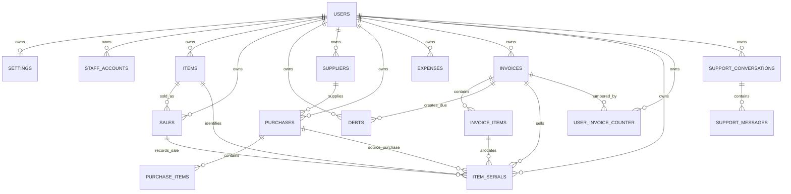

# Database Schema Reference

## Purpose and scope

This document describes the application database defined in
[`migrations/full_updated_schema.sql`](../migrations/full_updated_schema.sql).
It is written for development and maintenance: for every table it explains the
columns, where their values come from, and their dependencies on other tables.

The application uses PostgreSQL. All business data is scoped to an owner
account through `user_id` (or, for staff/support data, through
`owner_user_id`). A staff member acts inside the owner's workspace; staff do
not have a separate inventory, sales, or settings dataset.

### Value-source legend

| Source         | Meaning                                                                                                              |
| -------------- | -------------------------------------------------------------------------------------------------------------------- |
| **User input** | Entered in a web form or submitted by the authenticated user/staff API request. The backend validates/normalizes it. |
| **Session**    | Taken from the authenticated owner/workspace in the signed session, never trusted from a browser-provided `user_id`. |
| **System**     | Created by PostgreSQL, a trigger, or application logic (for example `NOW()` or a generated sequence).                |
| **Derived**    | Calculated by backend/database code from other submitted or stored values.                                           |
| **Reference**  | Copied from, or selected from, a related existing record.                                                            |
| **Default**    | Applied by PostgreSQL if the API does not send a value.                                                              |

## Relationship overview

### Delete behaviour

- Deleting an owner from `users` cascades to their workspace data, including
  staff, inventory, purchases, invoices, expenses, support conversations and
  related child rows.
- Deleting a purchase cascades to its `purchase_items` and any serials directly
  tied to it. Deleting an invoice cascades to its `invoice_items`; linked debt
  and serial records retain their row but their `invoice_id` / `invoice_item_id`
  is set to `NULL` where configured.
- `sales` and `invoices` are historical records. The application should not
  delete them casually because reports and debt/serial links depend on them.

---

## 1. `users`

One row per owner account. This is the root table for a business workspace.

| Column                  | Type / rule                      | Value source                                                       | Links / notes                                                  |
| ----------------------- | -------------------------------- | ------------------------------------------------------------------ | -------------------------------------------------------------- |
| `id`                    | `SERIAL`, primary key            | System                                                             | Referenced by all owner-scoped tables.                         |
| `name`                  | `VARCHAR(50)`, required          | User input at registration; owner Account page can update it       | Displayed as owner name.                                       |
| `email`                 | `VARCHAR(100)`, required, unique | User input at registration/account edit or verified Google profile | Login identifier; normalized by backend.                       |
| `mobile_number`         | 10 digits                        | User input at registration/account edit                            | Can be a login identifier; validated by database and API.      |
| `password_hash`         | `VARCHAR(255)`, required         | Derived from the user's password using bcrypt                      | Never store or return the plain password.                      |
| `is_verified`           | boolean, default `false`         | System / account-verification flow                                 | Verification state for local account flow.                     |
| `google_sub`            | nullable Google subject ID       | Reference from verified Google sign-in identity                    | Unique when present; never use email alone as Google identity. |
| `google_email_verified` | boolean, default `false`         | Reference from Google identity token                               | Records Google's email-verification claim.                     |
| `google_picture_url`    | text                             | Reference from Google profile                                      | Optional avatar URL.                                           |
| `verify_token`          | nullable                         | System, account-verification flow                                  | Temporary token; should be cleared after use.                  |
| `reset_token`           | nullable                         | System, password-reset flow                                        | Temporary reset token; should be cleared after use.            |
| `reset_token_expires`   | timestamp                        | System, password-reset flow                                        | Expiry for `reset_token`.                                      |
| `created_at`            | timestamp with timezone          | System default `NOW()`                                             | Creation audit time.                                           |
| `updated_at`            | timestamp with timezone          | System trigger on update                                           | Automatically refreshed by `update_timestamp()`.               |

**Direct children:** `staff_accounts`, `support_conversations`, `items`,
`sales`, `debts`, `suppliers`, `purchases`, `expenses`, `settings`, `invoices`,
`item_serials`, and `user_invoice_counter`.

## 2. `staff_accounts`

Staff login accounts belonging to one owner workspace.

| Column             | Type / rule                 | Value source                                                           | Links / notes                                       |
| ------------------ | --------------------------- | ---------------------------------------------------------------------- | --------------------------------------------------- |
| `id`               | `SERIAL`, primary key       | System                                                                 | Used as the staff actor ID in support/session data. |
| `owner_user_id`    | required integer            | Session: current owner when creating staff                             | FK to `users.id`; cascade delete.                   |
| `name`             | `VARCHAR(80)`, min. 2 chars | Owner input in Staff Management                                        | Staff's display name.                               |
| `username`         | `VARCHAR(50)`, min. 3 chars | Owner input in Staff Management                                        | Case/space-normalized unique login name.            |
| `password_hash`    | required                    | Derived from owner-provided staff password                             | bcrypt hash only.                                   |
| `page_permissions` | text array                  | Owner input (selected pages); default purchase entry and sales invoice | Controls which screens staff can access.            |
| `is_active`        | boolean, default `true`     | Owner input/update                                                     | Disabled staff cannot log in.                       |
| `created_at`       | timestamp with timezone     | System default                                                         | Audit field.                                        |
| `updated_at`       | timestamp with timezone     | System trigger                                                         | Audit field.                                        |

**Dependency:** many staff accounts belong to one `users` owner. It does not
have its own stock or settings tables.

## 3. `developer_admins`

Separate developer/support-admin login accounts. They are not shop owners.

| Column          | Type / rule                                 | Value source                           | Links / notes                                 |
| --------------- | ------------------------------------------- | -------------------------------------- | --------------------------------------------- |
| `id`            | `SERIAL`, primary key                       | System                                 | Stored as developer support-message actor ID. |
| `name`          | `VARCHAR(120)`, required                    | Developer-admin setup/management input | Support operator display name.                |
| `email`         | `VARCHAR(120)`, required, unique normalized | Developer-admin setup/management input | Developer login identifier.                   |
| `password_hash` | required                                    | Derived from developer-admin password  | bcrypt hash only.                             |
| `is_active`     | boolean, default `true`                     | Developer-admin management             | Disables developer login if false.            |
| `last_login_at` | timestamp with timezone                     | System on successful developer login   | Audit field.                                  |
| `created_at`    | timestamp with timezone                     | System default                         | Audit field.                                  |
| `updated_at`    | timestamp with timezone                     | System trigger                         | Audit field.                                  |

**Logical link:** `support_messages.sender_actor_id` can contain this ID when
`sender_type = 'developer'`; the schema deliberately does not enforce that as
a foreign key because one polymorphic actor column serves owners, staff, and
developers.

## 4. `support_conversations`

One support thread per owner/requester actor combination.

| Column                     | Type / rule                     | Value source                            | Links / notes                                                     |
| -------------------------- | ------------------------------- | --------------------------------------- | ----------------------------------------------------------------- |
| `id`                       | `SERIAL`, primary key           | System                                  | Referenced by `support_messages`.                                 |
| `owner_user_id`            | required integer                | Session (owner workspace)               | FK to `users.id`; cascade delete.                                 |
| `requester_actor_id`       | required integer                | Session actor ID                        | Owner `users.id` or staff `staff_accounts.id`, depending on role. |
| `requester_role`           | `owner` or `staff`              | Session                                 | Checked by database.                                              |
| `requester_name`           | required text                   | Reference from current owner/staff name | Snapshot for support display.                                     |
| `requester_identifier`     | nullable text                   | Reference from current email/username   | Snapshot identifier.                                              |
| `status`                   | `open`/`closed`, default `open` | User/developer support action           | Checked by database.                                              |
| `unread_for_user`          | integer, default `0`            | Derived by support message/read actions | User-side unread counter.                                         |
| `unread_for_developer`     | integer, default `0`            | Derived by support message/read actions | Developer-side unread counter.                                    |
| `last_message_at`          | nullable timestamp              | System when a message is inserted       | Used for support queue order.                                     |
| `created_at`, `updated_at` | timestamps                      | System default / trigger                | Audit fields.                                                     |

**Uniqueness:** `(owner_user_id, requester_actor_id, requester_role)` prevents
duplicate threads for the same requester.

## 5. `support_messages`

Individual messages in a support conversation.

| Column            | Type / rule             | Value source                           | Links / notes                                           |
| ----------------- | ----------------------- | -------------------------------------- | ------------------------------------------------------- |
| `id`              | `SERIAL`, primary key   | System                                 | Message identifier.                                     |
| `conversation_id` | required integer        | Reference from selected/current thread | FK to `support_conversations.id`; cascade delete.       |
| `sender_type`     | `user` or `developer`   | Session actor type                     | Database checked.                                       |
| `sender_actor_id` | required integer        | Session actor ID                       | Polymorphic logical link: owner/staff/developer; no FK. |
| `sender_role`     | required text           | Session role                           | E.g. owner, staff, developer.                           |
| `sender_name`     | required text           | Reference from current actor name      | Snapshot for display.                                   |
| `message_text`    | non-blank text          | User/developer support message input   | Database rejects blank content.                         |
| `created_at`      | timestamp with timezone | System default                         | Message order/audit.                                    |

## 6. `items`

Current inventory balance by owner and item name.

| Column                     | Type / rule           | Value source                                                                 | Links / notes                                          |
| -------------------------- | --------------------- | ---------------------------------------------------------------------------- | ------------------------------------------------------ |
| `id`                       | `SERIAL`, primary key | System                                                                       | Referenced by `sales` and `item_serials`.              |
| `user_id`                  | required integer      | Session                                                                      | FK to `users.id`; cascade delete.                      |
| `name`                     | required text         | Purchase item input; may be edited by inventory UI                           | User-facing inventory item name.                       |
| `quantity`                 | decimal, default `0`  | Derived: increased by purchase, reduced/returned by invoice stock processing | Current aggregate stock, not a manually trusted total. |
| `buying_rate`              | decimal, default `0`  | Purchase item input                                                          | Latest/current purchase rate used as cost reference.   |
| `selling_rate`             | decimal, default `0`  | Purchase item input or inventory edit                                        | Default sale rate.                                     |
| `created_at`, `updated_at` | timestamps            | System default / trigger                                                     | Audit fields.                                          |

**Dependency:** unique lookup is effectively `(user_id, normalized name)` in
application logic. One item can have many `sales` and `item_serials` rows.

## 7. `sales`

Sales ledger records produced while an invoice is created; it is not normally
entered directly by a user.

| Column          | Type / rule                   | Value source                                                  | Links / notes                                |
| --------------- | ----------------------------- | ------------------------------------------------------------- | -------------------------------------------- |
| `id`            | `SERIAL`, primary key         | System                                                        | May be referenced by `item_serials.sale_id`. |
| `user_id`       | required integer              | Session                                                       | FK to `users.id`; cascade delete.            |
| `item_id`       | required integer              | Reference from stock allocation                               | FK to `items.id`; cascade delete.            |
| `quantity`      | required decimal              | Derived from submitted invoice item/serial allocation         | Negative quantity represents a return.       |
| `cost_price`    | required decimal, default `0` | Reference from `items.buying_rate` at sale time               | Historical cost snapshot.                    |
| `selling_price` | required decimal              | Invoice item rate                                             | Price per unit before GST.                   |
| `total_price`   | required decimal              | Derived: quantity × selling price                             | Sale base amount before GST.                 |
| `gst_amount`    | decimal, default `0`          | Derived from `settings.gst_rate` and allocated invoice amount | GST snapshot for this sale record.           |
| `created_at`    | timestamp with timezone       | System default                                                | Sale time.                                   |

**Dependency:** one `items` row can create many sales. A serialised sale may
link back through `item_serials.sale_id`.

## 8. `debts`

Customer outstanding-balance ledger. A debt is automatically created for a
credit/partial invoice and can also be managed through debt-related flows.

| Column                     | Type / rule              | Value source                              | Links / notes                                              |
| -------------------------- | ------------------------ | ----------------------------------------- | ---------------------------------------------------------- |
| `id`                       | `SERIAL`, primary key    | System                                    | Debt identifier.                                           |
| `user_id`                  | required integer         | Session                                   | FK to `users.id`; cascade delete.                          |
| `customer_name`            | required text            | Invoice/debt form input                   | Customer display name.                                     |
| `customer_number`          | required 10 digits       | Invoice/debt form input                   | Customer mobile number; database validated.                |
| `customer_address`         | nullable text            | Invoice/debt form input                   | Stored customer address.                                   |
| `total`                    | decimal, default `0`     | Invoice total or debt form input          | Total amount due originally.                               |
| `credit`                   | decimal, default `0`     | Invoice amount paid / debt payment update | Amount already received.                                   |
| `balance`                  | stored generated decimal | Derived by PostgreSQL: `total - credit`   | Do not insert/update directly.                             |
| `remark`                   | nullable text            | Invoice description or debt form input    | Invoice-created rows include invoice/payment context.      |
| `invoice_id`               | nullable integer         | Reference from invoice creation           | FK to `invoices.id`; becomes `NULL` if invoice is deleted. |
| `created_at`, `updated_at` | timestamps               | System default / trigger                  | Audit fields.                                              |

## 9. `suppliers`

Supplier master records. The purchase flow finds an existing supplier or
creates one from the submitted supplier details.

| Column                     | Type / rule           | Value source                 | Links / notes                          |
| -------------------------- | --------------------- | ---------------------------- | -------------------------------------- |
| `id`                       | `SERIAL`, primary key | System                       | Referenced by `purchases.supplier_id`. |
| `user_id`                  | required integer      | Session                      | FK to `users.id`; cascade delete.      |
| `name`                     | required text         | Purchase/supplier form input | Supplier name.                         |
| `mobile_number`            | nullable 10 digits    | Purchase/supplier form input | Database validates when supplied.      |
| `address`                  | nullable text         | Purchase/supplier form input | Supplier address.                      |
| `created_at`, `updated_at` | timestamps            | System default / trigger     | Audit fields.                          |

**Dependency:** one supplier has many `purchases`. Deleting a supplier cascades
to its purchases, so supplier deletion needs care.

## 10. `purchases`

Purchase bill header. The child line items are in `purchase_items`.

| Column                     | Type / rule                | Value source                                                | Links / notes                                      |
| -------------------------- | -------------------------- | ----------------------------------------------------------- | -------------------------------------------------- |
| `id`                       | `SERIAL`, primary key      | System                                                      | Referenced by `purchase_items` and `item_serials`. |
| `user_id`                  | required integer           | Session                                                     | FK to `users.id`; cascade delete.                  |
| `supplier_id`              | required integer           | Reference from find/create supplier step                    | FK to `suppliers.id`; cascade delete.              |
| `bill_no`                  | nullable text              | Purchase form input                                         | Supplier bill/reference number.                    |
| `purchase_date`            | timestamp, default `NOW()` | Purchase form date, converted by backend; otherwise default | Purchase date/time.                                |
| `subtotal`                 | decimal                    | Derived: sum of `purchase_items.line_total`                 | Do not trust a browser-sent total.                 |
| `amount_paid`              | decimal                    | User payment input normalized by backend                    | Payment snapshot.                                  |
| `amount_due`               | decimal                    | Derived: subtotal minus amount paid                         | Payment snapshot.                                  |
| `payment_mode`             | text, default `cash`       | User input normalized by backend                            | Cash/other supported mode.                         |
| `payment_status`           | text, default `paid`       | Derived from subtotal/paid/mode                             | Paid/partial/due state.                            |
| `note`                     | nullable text              | Purchase form input                                         | Optional note.                                     |
| `created_at`, `updated_at` | timestamps                 | System default / trigger                                    | Audit fields.                                      |

## 11. `purchase_items`

Immutable-style purchase bill lines. They provide the source data for stock and
for serial-number provenance.

| Column         | Type / rule           | Value source                                 | Links / notes                                  |
| -------------- | --------------------- | -------------------------------------------- | ---------------------------------------------- |
| `id`           | `SERIAL`, primary key | System                                       | Referenced by `item_serials.purchase_item_id`. |
| `purchase_id`  | required integer      | Reference from newly created purchase header | FK to `purchases.id`; cascade delete.          |
| `item_name`    | required text         | Purchase item form input                     | A display snapshot; not an FK to `items`.      |
| `quantity`     | decimal               | Purchase item form input after validation    | Increases matching item stock.                 |
| `buying_rate`  | decimal               | Purchase item form input                     | Used to update the current item cost.          |
| `selling_rate` | decimal               | Purchase item form input                     | Used to update the current item sale rate.     |
| `line_total`   | decimal               | Derived: quantity × buying rate              | Calculated by backend.                         |

## 12. `expenses`

Business expense ledger.

| Column                     | Type / rule                | Value source                            | Links / notes                     |
| -------------------------- | -------------------------- | --------------------------------------- | --------------------------------- |
| `id`                       | `SERIAL`, primary key      | System                                  | Expense identifier.               |
| `user_id`                  | required integer           | Session                                 | FK to `users.id`; cascade delete. |
| `title`                    | required text              | Expense form input                      | Expense description.              |
| `category`                 | required text              | Expense form input                      | Category selected/typed by user.  |
| `amount`                   | decimal                    | Expense form input validated by backend | Expense amount.                   |
| `payment_mode`             | text, default `cash`       | Expense form input                      | Payment method.                   |
| `expense_date`             | timestamp, default `NOW()` | Expense form date; otherwise default    | Date of expense.                  |
| `note`                     | nullable text              | Expense form input                      | Optional note.                    |
| `created_at`, `updated_at` | timestamps                 | System default / trigger                | Audit fields.                     |

## 13. `settings`

One configuration row per owner workspace.

| Column                   | Type / rule              | Value source                                 | Links / notes                                           |
| ------------------------ | ------------------------ | -------------------------------------------- | ------------------------------------------------------- |
| `id`                     | `SERIAL`, primary key    | System                                       | Settings identifier.                                    |
| `user_id`                | required integer, unique | Session when settings are created/updated    | FK to `users.id`; one-to-one with owner.                |
| `shop_name`              | nullable text            | Owner registration/account/settings input    | Account page updates this value.                        |
| `shop_address`           | nullable text            | Settings form input                          | Printed/displayed on invoices where applicable.         |
| `gst_no`                 | nullable text            | Settings/invoice form input                  | Business GST number.                                    |
| `gst_rate`               | decimal, default `18.00` | Settings form input/default                  | Read during invoice creation to calculate GST.          |
| `default_profit_percent` | decimal, default `30.00` | Settings/inventory preferences input/default | Used as inventory price/profit default.                 |
| `bank_name`              | nullable text            | Settings form input                          | Invoice/payment bank details.                           |
| `account_holder_name`    | nullable text            | Settings form input                          | Invoice/payment bank details.                           |
| `account_number`         | nullable text            | Settings form input                          | Sensitive bank display value; protect in API responses. |
| `ifsc_code`              | nullable text            | Settings form input                          | Bank routing code.                                      |
| `upi_id`                 | nullable text            | Settings form input                          | UPI payment identifier.                                 |

**Dependency:** `users.id` is unique here, so each owner has zero or one row.
The registration flow creates the initial row with `shop_name`; later settings
and account flows upsert it.

## 14. `invoices`

Sales invoice header. Creating an invoice also creates invoice lines, sales
ledger rows, stock movements, and optionally a debt row.

| Column                     | Type / rule                | Value source                                       | Links / notes                                                       |
| -------------------------- | -------------------------- | -------------------------------------------------- | ------------------------------------------------------------------- |
| `id`                       | `SERIAL`, primary key      | System                                             | Referenced by invoice items, debts and serials.                     |
| `user_id`                  | required integer           | Session                                            | FK to `users.id`; cascade delete.                                   |
| `invoice_no`               | required unique text       | Derived by backend using `user_invoice_counter`    | Globally unique in current schema.                                  |
| `gst_no`                   | nullable text              | Invoice form input/settings reference              | GST number snapshot for this invoice.                               |
| `customer_name`            | nullable text              | Invoice form input                                 | Customer name.                                                      |
| `contact`                  | nullable text              | Invoice form input                                 | Required by backend for partial/due invoices (10-digit validation). |
| `address`                  | nullable text              | Invoice form input                                 | Customer address snapshot.                                          |
| `date`                     | timestamp, default `NOW()` | System at invoice creation (or explicit flow date) | Invoice date.                                                       |
| `subtotal`                 | decimal                    | Derived: sum of invoice item amounts               | Before GST.                                                         |
| `gst_amount`               | decimal                    | Derived from subtotal and `settings.gst_rate`      | GST total snapshot.                                                 |
| `total_amount`             | decimal                    | Derived: subtotal + GST                            | Invoice grand total.                                                |
| `payment_mode`             | text, default `cash`       | Invoice form input normalized by backend           | Payment method.                                                     |
| `payment_status`           | text, default `paid`       | Derived from total and paid amount                 | Paid/partial/due state.                                             |
| `amount_paid`              | decimal                    | User payment input normalized by backend           | Payment snapshot.                                                   |
| `amount_due`               | decimal                    | Derived: total amount minus paid amount            | Creates/updates debt flow when positive.                            |
| `created_at`, `updated_at` | timestamps                 | System default / trigger                           | Audit fields.                                                       |

## 15. `invoice_items`

Invoice line items. A line is matched to inventory by normalized description in
application code; there is intentionally no direct `item_id` foreign key.

| Column        | Type / rule           | Value source                                     | Links / notes                                 |
| ------------- | --------------------- | ------------------------------------------------ | --------------------------------------------- |
| `id`          | `SERIAL`, primary key | System                                           | Referenced by `item_serials.invoice_item_id`. |
| `invoice_id`  | required integer      | Reference from newly created invoice             | FK to `invoices.id`; cascade delete.          |
| `description` | nullable text         | Invoice item form input                          | Item description/name snapshot.               |
| `quantity`    | decimal               | Invoice item form input after backend validation | Positive sale or negative return.             |
| `rate`        | decimal               | Invoice item form input/default rate             | Selling rate before GST.                      |
| `amount`      | decimal               | Derived: quantity × rate                         | Line base amount before GST.                  |

## 16. `item_serials`

Tracks each unique serial-numbered unit from purchase to sale. This table is
used only when the purchase item includes serial numbers.

| Column             | Type / rule                              | Value source                                                | Links / notes                                                 |
| ------------------ | ---------------------------------------- | ----------------------------------------------------------- | ------------------------------------------------------------- |
| `id`               | `SERIAL`, primary key                    | System                                                      | Serial record identifier.                                     |
| `user_id`          | required integer                         | Session                                                     | FK to `users.id`; serial is unique per owner workspace.       |
| `item_id`          | required integer                         | Reference from inventory item created/found during purchase | FK to `items.id`; cascade delete.                             |
| `purchase_id`      | nullable integer                         | Reference from purchase header                              | FK to `purchases.id`; cascade delete.                         |
| `purchase_item_id` | nullable integer                         | Reference from purchase line                                | FK to `purchase_items.id`; cascade delete.                    |
| `invoice_id`       | nullable integer                         | Reference when sold on an invoice                           | FK to `invoices.id`; set `NULL` if invoice deleted.           |
| `invoice_item_id`  | nullable integer                         | Reference when sold on an invoice line                      | FK to `invoice_items.id`; set `NULL` if invoice line deleted. |
| `sale_id`          | nullable integer                         | Reference from generated sales ledger row                   | FK to `sales.id`; set `NULL` if sale deleted.                 |
| `serial_no`        | required text                            | Purchase serial-number input                                | Original/display serial number.                               |
| `serial_no_norm`   | required text                            | Derived: normalized serial number                           | Used with `user_id` for uniqueness and lookup.                |
| `sale_rate`        | decimal, default `0`                     | Reference from purchase item selling rate                   | Default sale-rate snapshot.                                   |
| `status`           | `in_stock` or `sold`, default `in_stock` | System: set to `sold` during serial allocation              | Database checked.                                             |
| `created_at`       | timestamp with timezone                  | System default                                              | Received/registered time.                                     |
| `sold_at`          | nullable timestamp                       | System when serial is allocated to a sale                   | Sale time.                                                    |

## 17. `user_invoice_counter`

Per-owner, per-day counter used to safely generate invoice numbers under
concurrent requests.

| Column       | Type / rule                   | Value source                                              | Links / notes                                   |
| ------------ | ----------------------------- | --------------------------------------------------------- | ----------------------------------------------- |
| `user_id`    | primary-key component         | Session                                                   | FK to `users.id`; cascade delete.               |
| `date_key`   | primary-key component, `DATE` | Derived from current invoice date in application timezone | One sequence per owner per date.                |
| `next_no`    | integer, default `1`          | System invoice-number generation using atomic upsert      | Incremented when an invoice number is reserved. |
| `created_at` | timestamp with timezone       | System default                                            | Audit field.                                    |

**Key:** composite primary key `(user_id, date_key)`. This table is a utility
table, not an invoice header; it has no foreign key to `invoices`. The
background cleanup keeps date-key rows for 10 calendar days (inclusive): for
example, a row with `date_key = 2026-08-01` becomes eligible for deletion on
2026-08-10 in the `Asia/Kolkata` timezone. Removing it does not remove invoices.

---

## Cross-table data flows

### Registration and workspace setup

1. Registration creates `users` with the owner's input, hashing the password.
2. Registration/setup creates or upserts one `settings` row for the same
   `users.id` (initially including the shop name when supplied).
3. Staff accounts are created later in `staff_accounts` using that owner ID.

### Purchase and stock-in

1. The purchase form supplies supplier data, bill data, payment information and
   item lines.
2. The backend finds/creates `suppliers`, writes one `purchases` header and
   its `purchase_items` lines.
3. Each purchase line updates an existing matching `items` row or inserts a
   new one. Quantity, buying rate and selling rate are updated in the same
   transaction.
4. Each submitted serial number becomes an `item_serials` row linked to the
   purchase, purchase line and current inventory item.

### Invoice, sale and stock-out

1. The invoice form supplies customer, line, payment and optional GST input.
2. `user_invoice_counter` atomically creates the next invoice number.
3. The backend calculates invoice totals from line items and `settings.gst_rate`,
   then inserts `invoices` and `invoice_items`.
4. It allocates inventory, creates one or more `sales` rows, and changes
   `items.quantity`.
5. For serialised stock, it marks `item_serials` as `sold` and links it to the
   invoice, invoice item and generated sales row.
6. If `amount_due > 0`, it creates a linked `debts` row.

### Support chat

1. The signed user/staff/developer session determines the actor ID, role and
   name; these are not accepted as trusted browser values.
2. A `support_conversations` row is found/created for the owner/requester
   combination.
3. Each message creates `support_messages` and updates conversation unread
   counters and `last_message_at`.

### Invoice counter retention

The invoice-counter cleanup job runs once per day at 00:10 in the
`Asia/Kolkata` timezone. It deletes `user_invoice_counter` rows that are 10
calendar days old under the same rule for every owner. Only the counter row is deleted;
`invoices.invoice_no` remains permanently stored.

## Important maintenance notes

- Keep the migration file and `db.js` compatibility setup aligned. `db.js`
  includes safe `ADD COLUMN IF NOT EXISTS` operations for older deployments,
  but the migration is the canonical schema for a fresh database.
- Application ownership checks must always use the session owner ID. Never use
  a `user_id` supplied by the client to read or write tenant data.
- Do not expose `password_hash`, verification/reset tokens, or bank details in
  public or staff responses.
- `invoice_items.item_id` does not exist. If a permanent per-item invoice link
  is needed later, add it via a reviewed migration and backfill strategy rather
  than inferring it from a description forever.
- The schema's foreign keys describe hard database dependencies. Several actor
  fields in support tables are polymorphic logical references and must be
  validated by backend role-aware logic.
